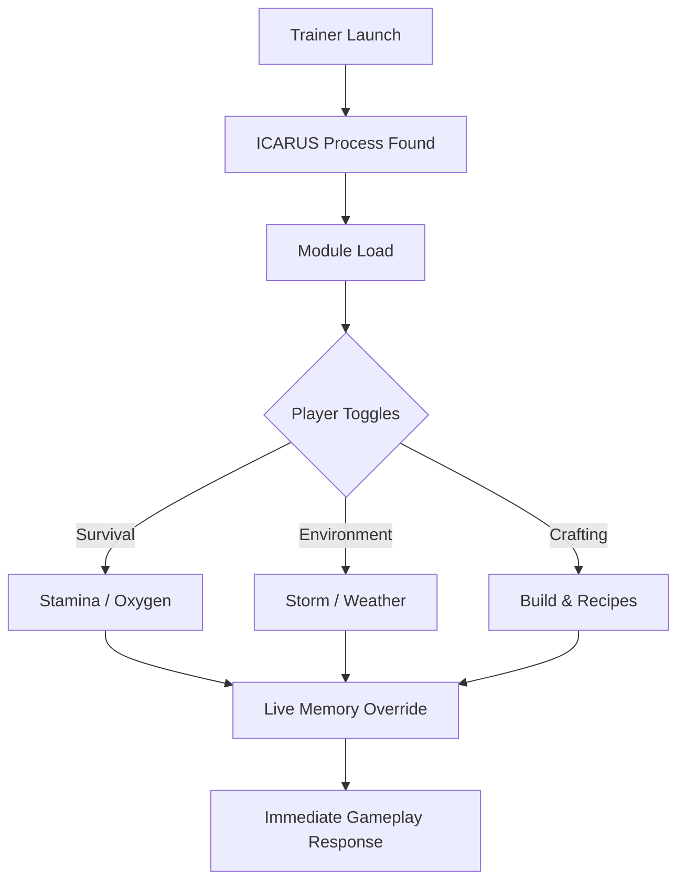

# ICARUS Trainer

On ICARUS, the planet does not forgive.
It remembers every misstep, every storm faced unprepared, every breath taken too late. **ICARUS Trainer** exists not to silence that danger—but to *negotiate* with it, quietly, intelligently, inside the unforgiving expanse of ICARUS.

This is not domination.
It is preparation.

---

## 🌍 Overview

ICARUS Trainer is an external PC enhancement tool designed to give players **measured control over survival mechanics**, crafting pressure, environmental damage, and progression pacing.

Built for long expeditions and experimental runs, the trainer allows you to:

* Reduce repetition without erasing risk
* Learn systems without restarting hours of progress
* Fine-tune difficulty for solo or co-op practice

Every feature is modular. Every choice remains yours.

---

## 🧭 Core Systems & Modules

Each module is optional, adjustable in real time, and crafted to preserve immersion.

* **Survival Stabilizers**
  Infinite or frozen stamina, oxygen, water, and food for endurance testing 🌬️

* **Environmental Resistance**
  Reduce storm, heat, cold, fall, and poison damage without disabling danger 🌩️

* **Crafting & Build Flow**
  Instant crafting, no material consumption, or accelerated build timers 🛠️

* **Combat Balance Controls**
  Damage multipliers, health locks, and stamina tuning for creature encounters 🦴

* **Progression & XP Shaping**
  Control experience gain to explore tech trees without grind 📈

> [!NOTE]
> All adjustments are memory-based and vanish once the session ends.

---

## ⚙️ Setup Sequence

Quiet. Efficient. Reliable.

1. Launch **ICARUS**
2. Run ICARUS Trainer as Administrator
3. Wait for automatic process detection
4. Open the trainer overlay (`Insert` by default)
5. Enable only the systems you need

```text
Start Game → Launch Trainer → Detect Process → Toggle Modules → Survive Smarter
```

> [!IMPORTANT]
> Always start the game **before** activating trainer features for proper synchronization.

---

## 🧠 Internal Flow Logic



No save edits. No file tampering. Only live-world adjustment.

---

## ❓ Frequently Asked Questions

**Is ICARUS Trainer safe for single-player use?**
Yes. It is intended for offline, solo environments.

**Will my save files be affected?**
No. All changes are temporary and memory-based.

**Can I save different loadouts?**
Yes. Profiles allow instant switching between playstyles.

**Does it work after updates?**
Minor patches are usually supported automatically. Larger updates may require a refreshed build.

**Is there a performance hit?**
No noticeable impact on modern PCs.

---

## 🌫️ Philosophy of Survival

ICARUS is not cruel—it is honest. It tests preparation, patience, and adaptation. The trainer does not erase that truth. It lets you **decide which lessons matter**, and which repetitions no longer serve you.

Use it to:

* Practice late-game expeditions
* Test base designs against storms
* Explore biomes without restarting missions

Or simply to breathe, and look at the horizon.

---

## 🌌 Final Thoughts

ICARUS Trainer is not a shield against the planet.
It is a map drawn in pencil.

For explorers who learn by touching fire.
For builders who plan before the storm.
For survivors who know control is quiet.

Step onto the surface prepared.
Let the planet test something worthy.

---
